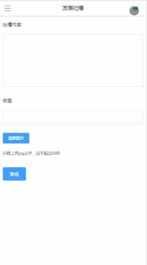

# weapp-tucao

前后端分离的吐槽WebApp<br/>
欢迎star [github](https://github.com/Kiritoken/tucao.git)


## Description
- 利用Apache-Shiro实现了鉴权
- 利用RabbitMQ对邮件服务实现了解耦以及可靠性的邮件投递
- 采用了七牛云存储图片url

## 技术栈

#### 后端
* SpringBoot
* MySql
* RabbitMQ
* Redis

#### 前端
* vue-cli 主要采用了基于vue.js重写Cnodejs.org社区的webapp整体框架

```
git@github https://github.com/shinygang/Vue-cnodejs
```
* Element-ui


## 演示

* 注册,邮箱激活


* 登陆


* 鉴权




##### Demo 用于学习交流, 转载请注明出处
